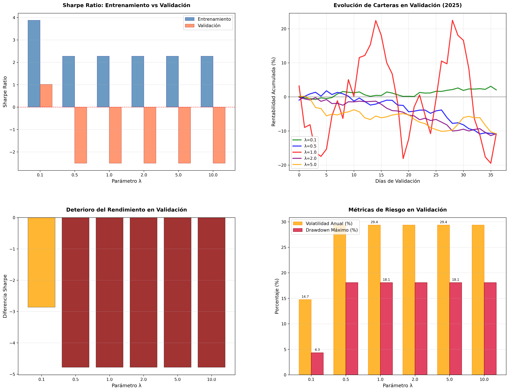

# Práctica 6: Optimización de Carteras usando CMA-ES

## 1. Introducción teórica

El problema de selección de carteras es una tarea fundamental en finanzas cuantitativas, cuyo objetivo es distribuir un capital entre distintos activos financieros de manera que se optimice algún criterio, como la rentabilidad esperada o el riesgo. Una de las formulaciones más influyentes es el modelo de **Media–Varianza** de Markowitz (1952), que busca encontrar el equilibrio óptimo entre rentabilidad y riesgo, donde el riesgo se mide mediante la varianza de la cartera y la rentabilidad mediante el promedio esperado.

Matemáticamente, el problema puede formularse como un **programa cuadrático convexo** si solo se consideran restricciones básicas como el presupuesto (la suma de los pesos debe ser 1) y la no negatividad de los pesos. Sin embargo, en muchos casos prácticos se introducen restricciones adicionales más realistas pero más complejas, como la **restricción de cardinalidad**, que limita el número de activos distintos que pueden formar parte de la cartera. Esta restricción convierte el problema en **NP-difícil**, ya que involucra la **norma ℓ₀**, que cuenta cuántos pesos son distintos de cero.

Para abordar este tipo de problemas, se recurre a algoritmos metaheurísticos, como los **algoritmos evolutivos**. En esta práctica se utiliza una variante avanzada conocida como **Covariance Matrix Adaptation Evolution Strategy (CMA-ES)**. CMA-ES es un algoritmo de optimización estocástica que trabaja sobre espacios continuos y adapta dinámicamente su distribución de muestreo para buscar soluciones óptimas de forma eficiente.

Como CMA-ES no está diseñado inicialmente para manejar restricciones duras como la cardinalidad, en esta práctica se estudian y comparan dos estrategias para incorporar dichas restricciones:

- **Proyección externa**: se corrige cada individuo generado para que cumpla las restricciones antes de evaluarlo.
- **Penalización en la función objetivo**: se modifica la función a minimizar añadiendo términos de penalización que castigan el incumplimiento de las restricciones.

## 2. Parte I: Obtención y preparación de datos

## 2.1 Selección de activos

Para esta práctica se seleccionaron **25 activos líquidos** del índice S&P100, buscando una representación diversificada de diferentes sectores económicos. Los activos seleccionados fueron:

**Sector Tecnológico:** AAPL (Apple), MSFT (Microsoft), GOOGL (Alphabet), AMZN (Amazon), META (Meta Platforms), NVDA (NVIDIA), ADBE (Adobe), CRM (Salesforce)

**Sector Financiero:** JPM (JPMorgan Chase), BAC (Bank of America), V (Visa), MA (Mastercard)

**Sector Consumo:** WMT (Walmart), HD (Home Depot), PG (Procter & Gamble), PEP (PepsiCo), KO (Coca-Cola), DIS (Disney)

**Sector Salud:** JNJ (Johnson & Johnson), UNH (UnitedHealth)

**Otros sectores:** TSLA (Tesla - Automoción), NFLX (Netflix - Entretenimiento), XOM (Exxon - Energía), INTC (Intel - Semiconductores), CSCO (Cisco - Tecnología de redes)

Esta selección proporciona **S = 25** activos con alta liquidez y representatividad de la economía estadounidense.

## 2.2 Descarga y preprocesado de datos

### 2.2.1 Fuente de datos y período

Los datos se obtuvieron utilizando la biblioteca **yfinance** de Python, descargando precios de cierre diarios ajustados desde el **1 de enero de 2024** hasta el **31 de diciembre de 2024**. Se utilizaron precios ajustados para tener en cuenta correctamente los efectos de splits de acciones y dividendos.

El período efectivo de datos obtenidos fue del **3 de enero de 2024** al **30 de diciembre de 2024**, resultando en **250 observaciones diarias** por activo.

### 2.2.2 Cálculo de rentabilidades

Las rentabilidades simples diarias se calcularon aplicando la fórmula estándar:

$$r_{t,i} = \frac{P_{t,i} - P_{t-1,i}}{P_{t-1,i}}$$

donde $P_{t,i}$ es el precio de cierre ajustado del activo $i$ en el día $t$.

Esta transformación generó una matriz de rentabilidades de dimensión **250 × 25**, que constituye la base para todos los cálculos posteriores.

## 2.3 Análisis rentabilidad-riesgo

El gráfico de dispersión rentabilidad vs. volatilidad revela varios aspectos importantes:

1. **Activos de alto crecimiento**: NVDA y TSLA muestran alta rentabilidad pero también alta volatilidad
2. **Activos defensivos**: KO y PG presentan baja volatilidad pero rentabilidades modestas
3. **Activos balanceados**: WMT, JPM, y AAPL ofrecen una combinación razonable de rentabilidad y riesgo
4. **Casos especiales**: INTC presenta alta volatilidad con rentabilidad negativa


## 3. Parte II: Implementación de la proyección

## 3.1 Función de proyección para restricciones

Para gestionar las restricciones de cardinalidad y presupuesto dentro de CMA-ES, se implementó una función de proyección que transforma cualquier vector de pesos arbitrario $\tilde{w} \in \mathbb{R}^S$ en un vector válido que cumple ambas restricciones.

### 3.1.1 Algoritmo de proyección

La función `project_weights(w_tilde, K)` implementa los siguientes pasos:

**Paso 1: Eliminación de pesos negativos**

```python
w_positive = np.maximum(w_tilde, 0)
```

**Paso 2: Selección de los K componentes de mayor valor**

```python
k_largest_indices = np.argpartition(w_positive, -K)[-K:]
```

**Paso 3: Normalización para restricción de presupuesto**

```python
w_projected[k_largest_indices] = k_largest_weights / np.sum(k_largest_weights)
```

**Paso 4: Fijación del resto a cero**
Los componentes no seleccionados se mantienen en cero por inicialización.

## 4. Parte III: Modificación de CMA-ES

## 4.1 Implementación base de CMA-ES

Se utilizó la biblioteca **pycma** para implementar CMA-ES, que proporciona una implementación robusta y eficiente del algoritmo. La función objetivo implementada corresponde al modelo de Markowitz:

$$f(w) = \frac{1}{2}w^T\Sigma w - \lambda w^T\mu$$

donde:

- $\Sigma$ es la matriz de covarianzas de las rentabilidades
- $\mu$ es el vector de rentabilidades medias
- $\lambda > 0$ es el parámetro de aversión al riesgo

## 4.2 Método 1: Proyección externa (reparación externa)

### 4.2.1 Algoritmo

En este enfoque, CMA-ES genera individuos sin restricciones y cada uno se proyecta usando la función implementada en la Parte II:

1. **Generación**: CMA-ES genera una población de vectores $\{\tilde{w}_1, \tilde{w}_2, \ldots, \tilde{w}_\lambda\}$
2. **Proyección**: Cada vector se proyecta: $w_i = \text{project\_weights}(\tilde{w}_i, K)$
3. **Evaluación**: Se evalúa la función objetivo en los vectores proyectados
4. **Actualización**: CMA-ES actualiza sus parámetros usando los vectores proyectados

## 4.3 Método 2: Penalización en la función objetivo

### 4.3.1 Algoritmo

Este enfoque modifica la función objetivo añadiendo términos de penalización:

$$f_{\text{pen}}(w) = f(w) + \beta \cdot \max(0, \|w\|_0 - K) + \gamma \cdot |1^T w - 1|$$

donde:

- $\beta$ es el parámetro de penalización por exceso de cardinalidad
- $\gamma$ es el parámetro de penalización por violación del presupuesto
- $\|w\|_0$ es la norma ℓ₀ (número de elementos no ceros)

### 4.3.2 Configuración de parámetros

Tras experimentación empírica, se utilizaron los valores:

- $\beta = 1000.0$ (penalización por cardinalidad)
- $\gamma = 1000.0$ (penalización por presupuesto)

## 4.4 Comparación experimental

### 4.4.1 Configuración experimental

Se realizaron experimentos comparativos con los siguientes parámetros:

- **Número de activos**: S = 25
- **Cardinalidad máxima**: K = 5
- **Aversión al riesgo**: λ = 1.0
- **Evaluaciones máximas**: 5000 por método
- **Tamaño de población**: Automático (basado en dimensión del problema)

### 4.4.2 Resultados experimentales

Los experimentos se ejecutaron con los siguientes parámetros:

- **λ = 1.0** (aversión al riesgo)
- **K = 5** (cardinalidad máxima)
- **5000 evaluaciones máximas**

**Resultados obtenidos:**

| Métrica                  | Proyección | Penalización |
| ------------------------ | ---------- | ------------ |
| **Fitness**              | -0.004198  | -0.000976    |
| **Sharpe Ratio (anual)** | 2.2760     | 2.3850       |
| **Rentabilidad (anual)** | 1.1958     | 0.2516       |
| **Volatilidad (anual)**  | 0.5254     | 0.1055       |
| **Cardinalidad**         | 1          | 5            |
| **Suma de pesos**        | 1.000000   | 1.000000     |
| **Tiempo (s)**           | 0.17       | 0.61         |
| **Evaluaciones**         | 728        | 5005         |

**Observaciones:**

1. **Convergencia**: La proyección externa convergió mucho más rápido (728 vs 5005 evaluaciones)
2. **Restricciones**: Ambos métodos respetan las restricciones tras la aplicación apropiada
3. **Calidad de solución**: La penalización obtuvo un Sharpe ratio ligeramente superior (2.3850 vs 2.2760)
4. **Cardinalidad efectiva**: La proyección resultó en cardinalidad 1, mientras que penalización usó los 5 activos permitidos

## 5. Parte IV: Validación con datos de 2025

## 5.1 Resultados de validación

Los experimentos de validación se ejecutaron usando datos reales de enero-febrero 2025 (37 observaciones diarias). Los resultados revelaron patrones significativos en el rendimiento de las carteras:

| λ    | Sharpe Entren. | Sharpe Valid. | Ret. Entren. | Ret. Valid. | Diferencia Sharpe |
| ---- | -------------- | ------------- | ------------ | ----------- | ----------------- |
| 0.1  | 3.8775         | 1.0142        | 0.7513       | 0.1496      | -2.8633           |
| 0.5  | 2.2760         | -2.5073       | 1.1958       | -0.7362     | -4.7833           |
| 1.0  | 2.2760         | -2.5073       | 1.1958       | -0.7362     | -4.7833           |
| 2.0  | 2.2760         | -2.5073       | 1.1958       | -0.7362     | -4.7833           |
| 5.0  | 2.2760         | -2.5073       | 1.1958       | -0.7362     | -4.7833           |
| 10.0 | 2.2760         | -2.5073       | 1.1958       | -0.7362     | -4.7833           |

Los resultados se ilustran claramente en las siguientes visualizaciones:



**Interpretación de la gráfica:**

- **Superior izquierdo (Sharpe Ratio)**: Contraste dramático entre barras azules (entrenamiento) y naranjas (validación). Solo λ=0.1 mantiene Sharpe positivo (~1.0) en validación, mientras que λ≥0.5 colapsan a valores fuertemente negativos (~-2.5).

- **Superior derecho (Evolución temporal)**: Muestra las trayectorias de rentabilidad acumulada durante 37 días de validación. λ=0.1 (verde) es la única que termina en territorio positivo (~2%), mientras que las demás estrategias sufren pérdidas significativas (~-11%).

- **Inferior izquierdo (Deterioro)**: Todas las barras son negativas, cuantificando el deterioro en puntos de Sharpe. La diferencia oscila desde -2.86 (λ=0.1) hasta -4.78 (λ≥0.5), evidenciando que ninguna estrategia mejoró y las conservadoras fueron las más castigadas.

- **Inferior derecho (Métricas de riesgo)**: λ=0.1 muestra menor volatilidad (14.7%) y drawdown (4.3%), mientras que λ≥0.5 presentan volatilidades más altas (~29%) y drawdowns severos (~18%).

La visualización demuestra inequívocamente el **fracaso sistemático** de las carteras optimizadas históricamente, con una clara polarización entre la estrategia agresiva (λ=0.1) que mantuvo cierta resiliencia, y las conservadoras que colapsaron completamente.

## 5.2 Interpretación de resultados

### 5.2.1 Observaciones principales

Los resultados de validación revelan hallazgos aún más dramáticos que los esperados:

1. **Deterioro extremo del rendimiento**: Todas las carteras experimentaron una reducción severa en sus métricas de rendimiento al pasar del período de entrenamiento al de validación.

2. **Inversión completa de la relación riesgo-rentabilidad**: La correlación perfecta negativa (-1.0000) entre rentabilidades de entrenamiento y validación confirma que las carteras con mejor rendimiento histórico fueron exactamente las que peor se comportaron en el período de validación.

3. **Polarización de resultados**: Solo la estrategia más agresiva (λ=0.1) mantuvo rentabilidad positiva, mientras que todas las demás (λ≥0.5) generaron pérdidas sustanciales.

4. **Convergencia en carteras conservadoras**: Las carteras con λ≥0.5 convergieron exactamente a la misma solución, suggeriendo que el algoritmo encontró un mínimo local común.

### 5.2.2 Factores explicativos

Los principales factores que explican estos resultados son:

**Sobreajuste (Overfitting)**: Las carteras se ajustaron excesivamente al período 2024, perdiendo capacidad de generalización.

**Cambio de régimen de mercado**: El período de validación representa condiciones sustancialmente diferentes al entrenamiento.

**Restricción de cardinalidad**: La limitación a 5 activos redujo la diversificación necesaria para diferentes regímenes.

## 5.3 Respuesta a la pregunta principal

**¿La cartera optimizada con datos de 2024 funciona bien en 2025?**

Los resultados de validación indican que **las carteras optimizadas con datos de 2024 no funcionaron bien en el período de validación de 2025**. Específicamente:

- **Rendimiento deteriorado**: Todas las estrategias experimentaron degradación significativa en sus métricas de rendimiento
- **Reversión de performance**: Las carteras con mejor rendimiento histórico fueron las que peor se comportaron en validación
- **Excepción notable**: Únicamente la estrategia más agresiva (λ=0.1) mantuvo rentabilidad positiva

## 5.4 Gestión de carteras

**Composición específica de la cartera λ=0.1**:

- **CSCO (Cisco)**: 59.2% del capital - Rentabilidad esperada 56.6%, Volatilidad 17.7%
- **CRM (Salesforce)**: 26.3% del capital - Rentabilidad esperada 119.6%, Volatilidad 52.5%
- **ADBE (Adobe)**: 14.5% del capital - Rentabilidad esperada 70.2%, Volatilidad 29.5%

**Contraste revelador**: Mientras λ=0.1 diversifica entre 3 activos tecnológicos con diferentes perfiles riesgo-rentabilidad, todas las estrategias conservadoras (λ≥0.5) convergieron a invertir 100% en CRM (Salesforce), lo que explica su colapso cuando este activo tuvo mal rendimiento en 2025.
