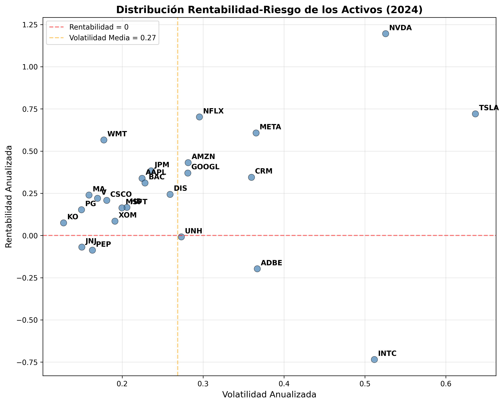

# Práctica 6: Optimización de Carteras usando CMA-ES

# 1. Introducción teórica

El problema de selección de carteras es una tarea fundamental en finanzas cuantitativas, cuyo objetivo es distribuir un capital entre distintos activos financieros de manera que se optimice algún criterio, como la rentabilidad esperada o el riesgo. Una de las formulaciones más influyentes es el modelo de **Media–Varianza** de Markowitz (1952), que busca encontrar el equilibrio óptimo entre rentabilidad y riesgo, donde el riesgo se mide mediante la varianza de la cartera y la rentabilidad mediante el promedio esperado.

Matemáticamente, el problema puede formularse como un **programa cuadrático convexo** si solo se consideran restricciones básicas como el presupuesto (la suma de los pesos debe ser 1) y la no negatividad de los pesos. Sin embargo, en muchos casos prácticos se introducen restricciones adicionales más realistas pero más complejas, como la **restricción de cardinalidad**, que limita el número de activos distintos que pueden formar parte de la cartera. Esta restricción convierte el problema en **NP-difícil**, ya que involucra la **norma ℓ₀**, que cuenta cuántos pesos son distintos de cero.

Para abordar este tipo de problemas, se recurre a algoritmos metaheurísticos, como los **algoritmos evolutivos**. En esta práctica se utiliza una variante avanzada conocida como **Covariance Matrix Adaptation Evolution Strategy (CMA-ES)**. CMA-ES es un algoritmo de optimización estocástica que trabaja sobre espacios continuos y adapta dinámicamente su distribución de muestreo para buscar soluciones óptimas de forma eficiente.

Como CMA-ES no está diseñado inicialmente para manejar restricciones duras como la cardinalidad, en esta práctica se estudian y comparan dos estrategias para incorporar dichas restricciones:

- **Proyección externa**: se corrige cada individuo generado para que cumpla las restricciones antes de evaluarlo.
- **Penalización en la función objetivo**: se modifica la función a minimizar añadiendo términos de penalización que castigan el incumplimiento de las restricciones.

Esta práctica, por tanto, combina la formulación matemática clásica de Markowitz con técnicas modernas de optimización evolutiva, permitiendo abordar problemas de selección de carteras realistas con restricciones estructurales complejas.

# 2. Parte I: Obtención y preparación de datos

## 2.1 Selección de activos

Para esta práctica se seleccionaron **25 activos líquidos** del índice S&P100, buscando una representación diversificada de diferentes sectores económicos. Los activos seleccionados fueron:

**Sector Tecnológico:** AAPL (Apple), MSFT (Microsoft), GOOGL (Alphabet), AMZN (Amazon), META (Meta Platforms), NVDA (NVIDIA), ADBE (Adobe), CRM (Salesforce)

**Sector Financiero:** JPM (JPMorgan Chase), BAC (Bank of America), V (Visa), MA (Mastercard)

**Sector Consumo:** WMT (Walmart), HD (Home Depot), PG (Procter & Gamble), PEP (PepsiCo), KO (Coca-Cola), DIS (Disney)

**Sector Salud:** JNJ (Johnson & Johnson), UNH (UnitedHealth)

**Otros sectores:** TSLA (Tesla - Automoción), NFLX (Netflix - Entretenimiento), XOM (Exxon - Energía), INTC (Intel - Semiconductores), CSCO (Cisco - Tecnología de redes)

Esta selección proporciona **S = 25** activos con alta liquidez y representatividad de la economía estadounidense.

## 2.2 Descarga y preprocesado de datos

### 2.2.1 Fuente de datos y período

Los datos se obtuvieron utilizando la biblioteca **yfinance** de Python, descargando precios de cierre diarios ajustados desde el **1 de enero de 2024** hasta el **31 de diciembre de 2024**. Se utilizaron precios ajustados para tener en cuenta correctamente los efectos de splits de acciones y dividendos.

El período efectivo de datos obtenidos fue del **3 de enero de 2024** al **30 de diciembre de 2024**, resultando en **250 observaciones diarias** por activo.

### 2.2.2 Cálculo de rentabilidades

Las rentabilidades simples diarias se calcularon aplicando la fórmula estándar:

$$r_{t,i} = \frac{P_{t,i} - P_{t-1,i}}{P_{t-1,i}}$$

donde $P_{t,i}$ es el precio de cierre ajustado del activo $i$ en el día $t$.

Esta transformación generó una matriz de rentabilidades de dimensión **250 × 25**, que constituye la base para todos los cálculos posteriores.

## 2.3 Análisis rentabilidad-riesgo

El gráfico de dispersión rentabilidad vs. volatilidad revela varios aspectos importantes:

1. **Activos de alto crecimiento**: NVDA y TSLA muestran alta rentabilidad pero también alta volatilidad
2. **Activos defensivos**: KO y PG presentan baja volatilidad pero rentabilidades modestas
3. **Activos balanceados**: WMT, JPM, y AAPL ofrecen una combinación razonable de rentabilidad y riesgo
4. **Casos especiales**: INTC presenta alta volatilidad con rentabilidad negativa



# 3. Parte II: Implementación de la proyección

## 3.1 Función de proyección para restricciones

Para gestionar las restricciones de cardinalidad y presupuesto dentro de CMA-ES, se implementó una función de proyección que transforma cualquier vector de pesos arbitrario $\tilde{w} \in \mathbb{R}^S$ en un vector válido que cumple ambas restricciones.

### 3.1.1 Algoritmo de proyección

La función `project_weights(w_tilde, K)` implementa los siguientes pasos:

**Paso 1: Eliminación de pesos negativos**

```python
w_positive = np.maximum(w_tilde, 0)
```

**Paso 2: Selección de los K componentes de mayor valor**

```python
k_largest_indices = np.argpartition(w_positive, -K)[-K:]
```

**Paso 3: Normalización para restricción de presupuesto**

```python
w_projected[k_largest_indices] = k_largest_weights / np.sum(k_largest_weights)
```

**Paso 4: Fijación del resto a cero**
Los componentes no seleccionados se mantienen en cero por inicialización.

